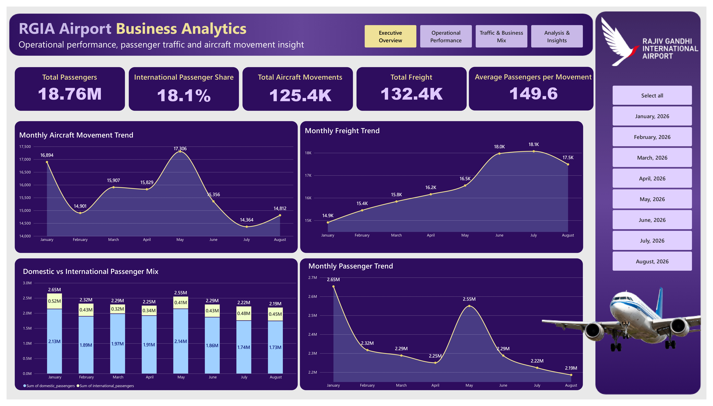
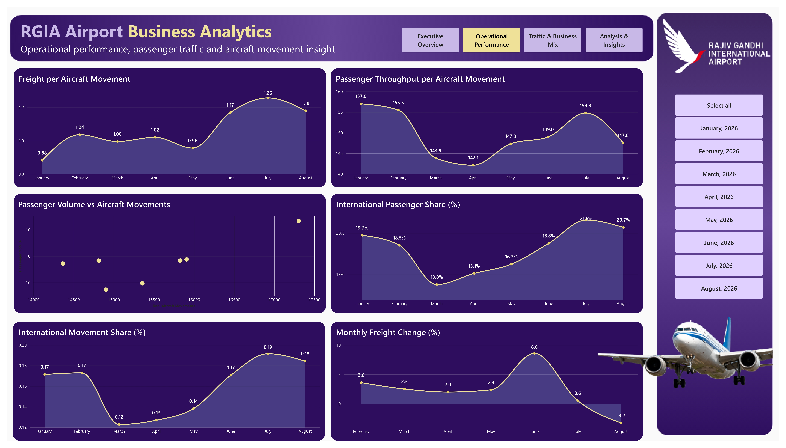
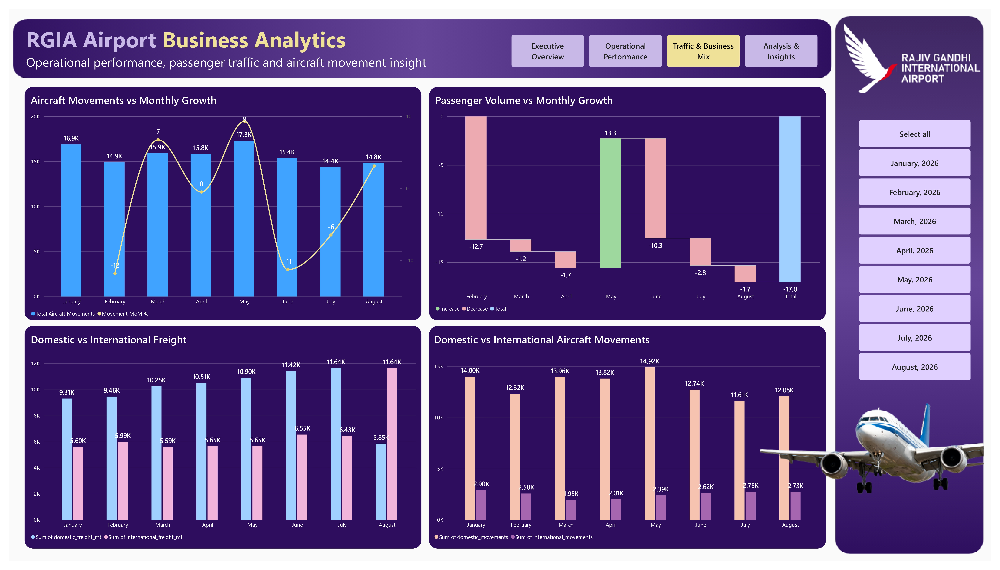
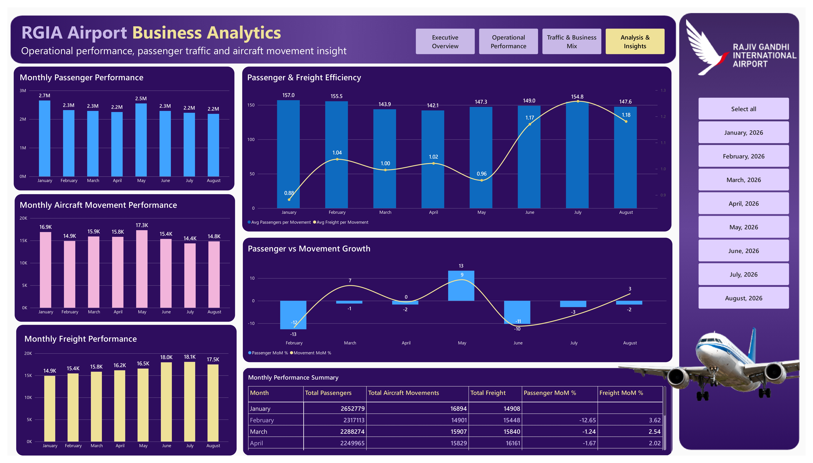

# RGIA Airport Business Analytics

## Operational Performance & Traffic Insights — January to August 2026

An end-to-end data analytics project focused on **passenger traffic, aircraft movements, air freight, operational efficiency, and domestic–international traffic patterns** at Rajiv Gandhi International Airport (RGIA), Hyderabad.

The project transforms monthly airport traffic data into a structured analytical solution using **Python, MySQL, DAX, and Power BI**.

---

## Project Overview

Rajiv Gandhi International Airport handles significant passenger, aircraft movement, and air cargo activity. This project analyzes monthly operational traffic data from **January to August 2026** to understand traffic patterns, operational performance, efficiency, and changes across domestic and international segments.

The analysis combines **Python-based data auditing, SQL analysis, DAX calculations, and an interactive Power BI dashboard** to turn raw airport traffic statistics into business-oriented operational insights.

---

## Business Objectives

- Monitor monthly passenger traffic and aircraft movements.
- Analyze domestic and international traffic patterns.
- Track air freight performance.
- Measure passenger throughput per aircraft movement.
- Measure freight handled per aircraft movement.
- Analyze month-on-month changes in key operational metrics.
- Identify periods of stronger and weaker operational performance.
- Provide an interactive dashboard for airport traffic analysis.

---

## Key Metrics

| Metric | Description |
|---|---|
| Total Passengers | Domestic + international passenger traffic |
| Aircraft Movements | Domestic + international aircraft movements |
| Total Freight | Domestic + international freight handled |
| Passenger Throughput | Passengers per aircraft movement |
| Freight per Movement | Freight handled per aircraft movement |
| Passenger MoM % | Month-on-month change in passenger traffic |
| Movement MoM % | Month-on-month change in aircraft movements |
| Freight MoM % | Month-on-month change in freight |

---

## Tools & Technologies

- **Python** — Data auditing and validation
- **Pandas** — Data processing and analysis
- **MySQL** — Data storage and SQL analysis
- **Power BI** — Interactive dashboard and visualization
- **DAX** — KPI calculations and analytical measures
- **Jupyter Notebook** — Data audit workflow

---

## Dashboard Preview

### RGIA Executive Overview

### RGIA Operational Performance

### RGIA Traffic & Business Mix

### RGIA Performance Insights

---

## Dashboard Pages

### 1. RGIA Executive Overview
Passenger, aircraft movement and freight performance — Jan–Aug 2026.

### 2. RGIA Operational Performance
Operational efficiency, throughput and month-on-month performance.

### 3. RGIA Traffic & Business Mix
Domestic and international traffic patterns across passengers, movements and freight.

### 4. RGIA Performance Insights
Efficiency trends, growth relationships and key operational insights.

---

## Analytics Outcome

The analysis converts airport traffic statistics into **actionable operational information** rather than simply reporting monthly passenger and flight counts.

It helps users understand:

- **Traffic demand:** How passenger volumes change across months and between domestic and international segments.
- **Operational activity:** How aircraft movements change alongside passenger traffic.
- **Airport utilization:** How many passengers are handled per aircraft movement.
- **Cargo performance:** How freight volumes change and how freight handled per movement varies over time.
- **Traffic mix:** How domestic and international activity contributes to overall airport operations.
- **Performance changes:** Which months experienced increases or declines in passengers, movements, and freight.
- **Operational relationships:** Whether changes in passenger traffic are accompanied by similar changes in aircraft movements.
- **Efficiency patterns:** Periods where passenger or freight throughput per movement was relatively higher or lower.

### Business Usefulness

This type of analysis can support **airport operations and planning teams** by providing a consolidated view of traffic demand and operational activity.

For example, comparing passenger volumes with aircraft movements can help identify changes in **passenger throughput per movement**, while tracking freight alongside movements provides an additional view of **cargo handling intensity**.

The dashboard can therefore be used as a **monitoring and analytical tool** for identifying traffic patterns, operational changes, and areas that may require further investigation.

---

## Data Source

The airport traffic statistics were sourced from **Airports Authority of India (AAI)** traffic statistics publications.

The analysis covers **January–August 2026** for RGIA / Hyderabad airport.

---

## Validation

The analytical workflow includes validation checks to ensure consistency between calculated and stored metrics.

Validation was performed across:

- Passenger totals
- Aircraft movement totals
- Freight totals
- Monthly calculations
- Cumulative metrics
- Derived efficiency measures

The final validation checks produced matching expected and actual results.

---

## Project Outcome

This project demonstrates an end-to-end analytics workflow:

**Data Audit → SQL Analysis → KPI Development → DAX → Power BI → Validation → Business Insights**

It demonstrates practical skills in **Python, SQL, Power BI, DAX, data validation, KPI development, and business-oriented operational analytics**.
